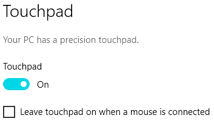

# TouchpadKeypad
Use touchpad as a keypad for osu!

If your going to use this to play osu! you might find that the low polling rates often found on touchpads (mine is 84hz) causes low accuracy. Laptops which use an interface other than PS/2 probably poll higher and can be increased.

## Requirements
Precision touch driver (you can usually install this if your laptop didn't come with it)

Windows 7+ though I have only tested it on Windows 10

## Usage
You can config the keys to be used in config.txt. By default they are Z and X

## TODO
Add logo

Test Windows 7 and 8/8.1. They both support HID_USAGE_DIGITIZER_TOUCH_PAD if precision drivers are installed

### For your cursor to not move from touchpad you need to disable "Leave touchpad on when a mouse is connected" in touchpad settings

